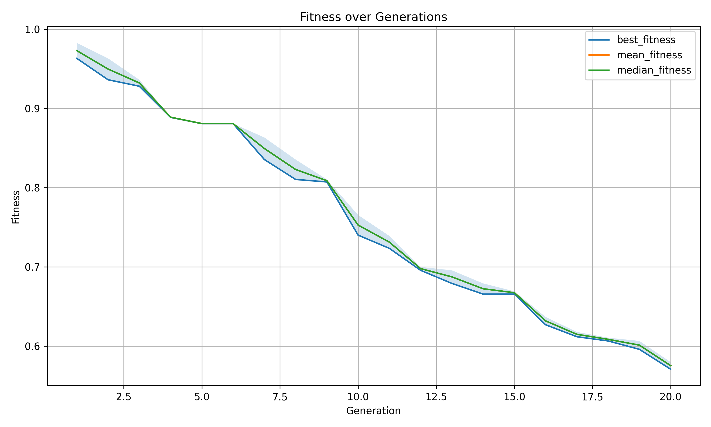
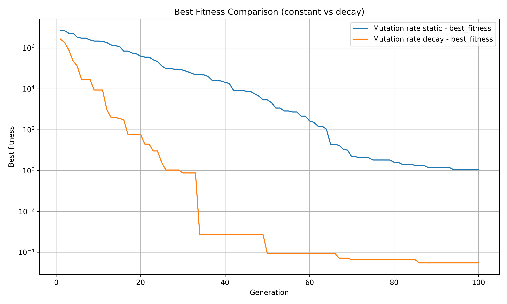
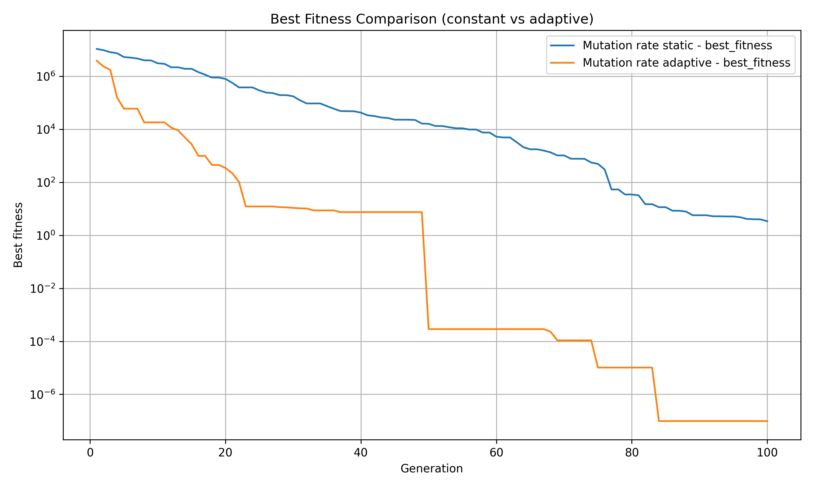
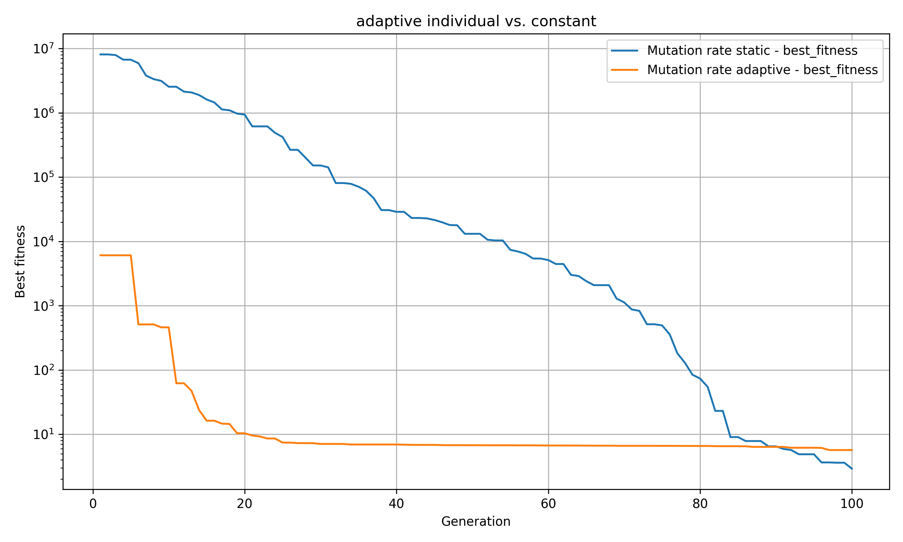
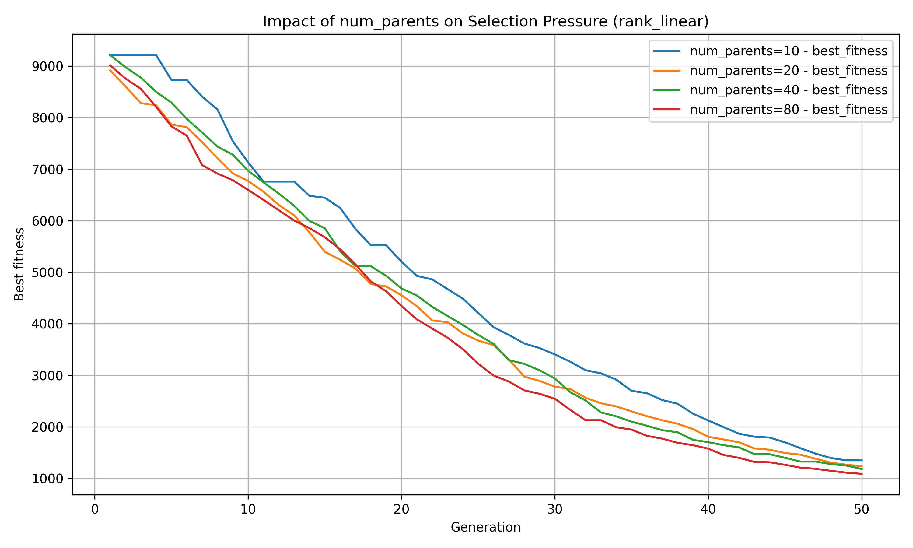
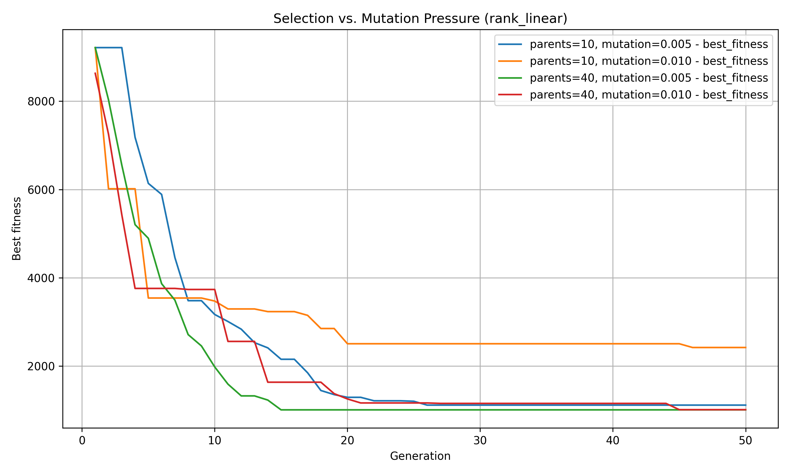
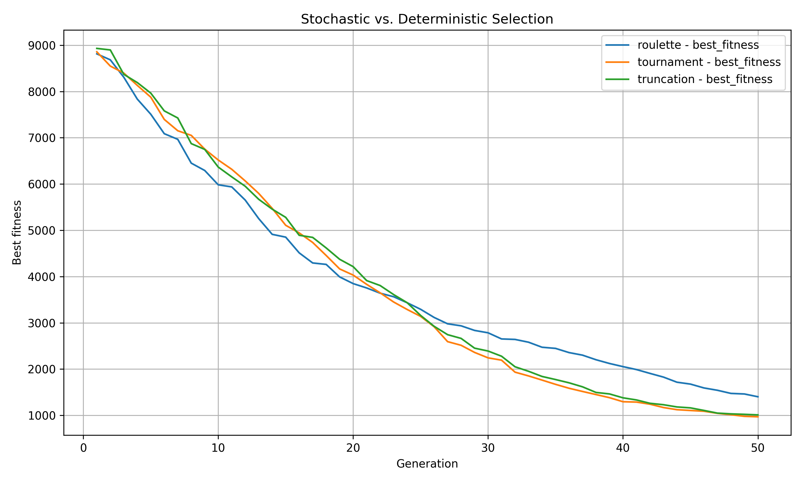
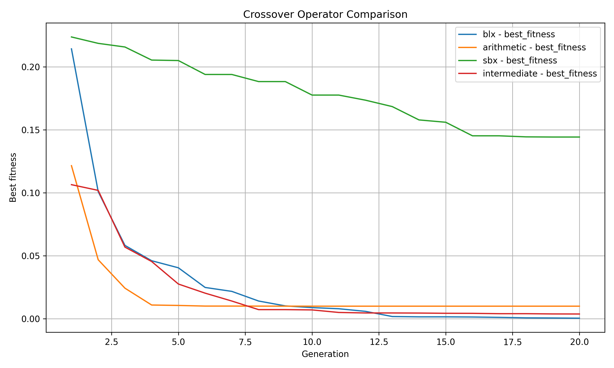

# 03\_comparisons – Comparative Experiments

This folder contains examples that **compare different algorithmic choices**.
The focus is on illustrating how mutation, crossover, and selection strategies influence convergence, diversity, and overall optimization behavior.


## Learning Goals

* Learn how to **inspect history** (`pop.print_history`, `plot_fitness`, `plot_history`).
* Compare runs with different **mutation settings** (strength, decay, global vs. individual adaptation).
* Understand the effect of **crossover operators** on convergence.
* Explore how **selection methods and parameters** influence exploration vs. exploitation.
* Combine factors (selection vs. mutation pressure) and observe trade-offs.

## Prerequisites

* Knowledge from `01_basic_usage` (population setup, fitness).
* Basic understanding of YAML configs (`population.yaml`, mutation/selection variants).
* Optional: familiarity with plotting (`matplotlib`).

## Files & Expected Output

Running these scripts will generate fitness curves and save plots into the `figures/` folder.


### `01_history.py`

Prints per-generation statistics with `pop.print_history()`.
Shows best, worst, mean, std, and IQR fitness values.

```
Evolution History:
 generation  best_fitness  worst_fitness  mean_fitness  std_fitness  iqr_fitness
          1      0.972999       0.976750      0.974875     0.001876     0.001876
          2      0.915368       0.919736      0.917552     0.002184     0.002184
          3      0.901505       0.906685      0.904095     0.002590     0.002590
          4      0.879684       0.901505      0.890594     0.010910     0.010910
[...]
```

### `02_plotting.py`

Introduces plotting:

* `plot_fitness(pop)` → default metrics (best, mean, median + std band).
* `plot_history(pop, metrics=[...])` → custom metrics (e.g. diversity).

<p align="center">
  
</p>

### `03_compare_runs.py`

Compares two runs with **different mutation strengths**.
Plots best fitness side by side to illustrate the impact of mutation scale.

<p align="center">
  
</p>

### `04_exponential_decay_vs_static.py`

Contrasts **static vs. exponentially decaying mutation strength** on Rosenbrock.
Illustrates how decay influences convergence.

<p align="center">
  
</p>

### `05_adaptive_global_vs_static.py`

Compares **global adaptive mutation** vs. static mutation strength.
Mutation parameters adapt across the whole population.

<p align="center">
  
</p>

### `06_adaptive_individual_vs_static.py`

Compares **individual-level adaptive mutation** (each individual adapts its own σ and τ) vs. static.
Highlights fine-grained adaptation.

<p align="center">
  
</p>

### `07_selection_comparison.py`

Runs multiple **selection strategies** (tournament, rank, roulette, SUS, Boltzmann, random, truncation).
Plots best fitness to reveal strengths and weaknesses.

<p align="center">
  
</p>

### `08_selection_pressure.py`

Varies **number of parents** under a fixed strategy (rank\_linear).
Shows how selection pressure changes with `num_parents`.

<p align="center">
  
</p>

### `09_selection_vs_mutation_pressure.py`

Explores the interaction between **selection pressure** and **mutation strength**.
Illustrates trade-offs: exploration vs. convergence speed.

<p align="center">
  
</p>

### `10_selection_stochastic_vs_deterministic.py`

Contrasts **roulette (stochastic)**, **tournament (semi-stochastic)**, and **truncation (deterministic)**.
Helps understand when randomness helps preserve diversity.

<p align="center">
  
</p>

### `11_crossover_comparison.py`

Compares different **crossover operators** (BLX, arithmetic, SBX, intermediate).
Mutation is disabled to isolate crossover effects.

<p align="center">
  
</p>

---

## See Also

* [`../02_strategies/`](../02_strategies) — step-by-step operator application and strategies.
* [`../01_basic_usage/`](../01_basic_usage) — fundamentals of Pop, Indiv, and config.
