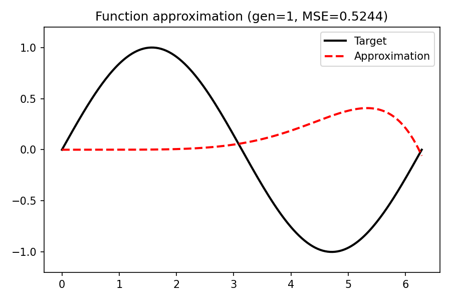

# Function Approximation with Evolutionary Strategies

This folder demonstrates how evolutionary optimization can be used to approximate a mathematical target function—specifically, the sine function—using two fundamentally different approaches:

---

## 📘 01 – Polynomial Approximation

- **File:** `01_polynomial_sine.py`
- **Goal:** Approximate `f(x) = sin(x)` using a 7th-degree polynomial.
- **Encoding:** Each individual contains polynomial coefficients.
- **Mutation Strategy:** `adaptive_per_parameter` with self-adaptive mutation strengths `σ_i` per coefficient.
- **Fitness:** Weighted MSE between the target function and the predicted polynomial over `[0, 2π]`, using Chebyshev-distributed evaluation points.
- **Plot Output:** `01_frames_poly/`

🔍 Highlights:
- Demonstrates the sensitivity of high-degree terms.
- Uses Chebyshev-based sampling to mitigate edge instability.
- Animation shows gradual convergence toward sine shape.

<p align="center">
  
</p>


---

## 📘 02 – Support Point Approximation

- **File:** `02_sine_point_approximation.py`
- **Goal:** Approximate `f(x) = sin(x)` by evolving y-values at fixed x-support points.
- **Encoding:** Each individual holds 16 y-values; x-values are fixed.
- **Interpolation:** Linear (`np.interp`) between support points.
- **Mutation Strategy:** Constant Gaussian mutation.
- **Fitness:** Weighted MSE over a dense evaluation grid.
- **Plot Output:** `02_frames_point/`

🔍 Highlights:
- Local, intuitive encoding (each gene maps to a concrete point).
- More stable than high-degree polynomials.
- Supports visual interpretation of each gene's effect.

<p align="center">
  
</p>

---

## 🎯 Comparison & Didactic Purpose

| Aspect               | Polynomial Approx.         | Point-Based Approx.          |
|----------------------|-----------------------------|-------------------------------|
| Representation       | Global (coefficients)       | Local (support y-values)      |
| Expressiveness       | High, but unstable at edges | Moderate, but stable          |
| Evolution Dynamics   | Sensitive to degree         | Robust and intuitive          |
| Mutation Model       | Self-adaptive σ per gene    | Fixed mutation strength       |
| Use Case             | Theory & numerical insight  | Practical robustness          |

Both methods are excellent to introduce the effects of representation, mutation design, and objective shaping in evolutionary algorithms.

---

## 📘 03 – Approximation with Noise

- **File:** `03_approximation_with_noise.py`
- **Goal:** Approximate noisy target values \( \sin(x) + \epsilon \), where \( \epsilon \sim \mathcal{N}(0, \sigma) \)
- **Focus:** Tests robustness of approximation strategies against data uncertainty
- **Encoding:** y-values at fixed support points (like Example 02)
- **Fitness:** MSE against **new noise sample per generation**
- **Plot Output:** `03_frames_noise/`

🔍 Highlights:
- Same representation as example 02, but under noisy conditions
- Demonstrates how evolutionary optimization can still converge
- Lays foundation for future smoothing/regularization

<p align="center">
  
</p>


## ▶️  Visualizations

Animations of the approximation process are saved in:

- `01_frames_poly/01_polynormal_sine.gif`
- `02_frames_point/02_sine_point.gif`
- `03_frames_point/03_sine_noise.gif`

---

## 🧪 Usage

Each script can be run directly and generates plots for each generation:

```bash
python 01_polynomial_sine.py
python 02_sine_point_approximation.py
python 03_approximation_with_noise
```

## ▶️  Animations can be generated with:
```bash
ffmpeg -framerate 10 -i 03_frames_noise/gen_%03d.png -c:v libx264 -pix_fmt yuv420p noise_fit.mp4
```
