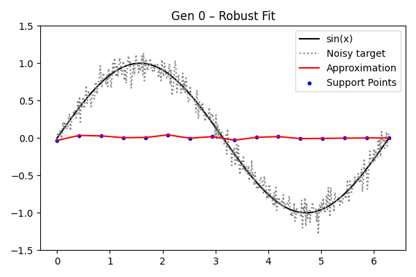

# 04_function_approximation - Function Approximation Tasks

This folder contains examples that **approximate mathematical functions** using evolutionary optimization.  
The focus is on understanding how different representations (polynomials, support points) and data conditions (noise) influence approximation quality.

## Learning Goals

* Learn how to formulate **function approximation** as an evolutionary optimization problem.
* Compare different **representation choices** (polynomial coefficients vs. support-point vectors).
* Observe how **noise in the target signal** affects the evolutionary process.
* Practice using custom fitness functions and plotting approximations with support points.

## Prerequisites

* Knowledge from `01_basic_usage` (population setup, fitness definition).
* Familiarity with `numpy` interpolation (`np.interp`) and polynomial evaluation (`np.polyval`).
* Optional: experience with plotting approximations (`plot_approximation`).

## Files & Expected Output

Running these scripts will generate frames in subfolders (`01_frames_poly`, `02_frames_point`, `03_frames_noise`).  

---

### `01_polynomial_sine.py`

Approximates **sin(x)** using a polynomial representation.  
Each individual encodes the coefficients of a polynomial. Fitness is the weighted mean squared error (MSE) against the true sine values.

  

---

### `02_sine_point_approximation.py`

Approximates **sin(x)** via **support points** (Y-vectors at fixed X positions).  
Predictions are obtained through interpolation.

More stable than polynomial representation.

  

---

### `03_approximation_with_noise.py`

Approximates **sin(x)** when the target signal is corrupted with Gaussian noise.  
A noisy target is re-sampled at the start of each generation.

Demonstrates robustness of evolutionary strategies under noise.
Visualizes differences between true function, noisy samples, and approximation.

  

---

## See Also

* [`../02_strategies/`](../02_strategies) — step-by-step operator application and strategies.
* [`../03_comparisons/`](../03_comparisons) — mutation, crossover, and selection comparisons.
* [`../06_netvector/`](../06_netvector) — neural-network-based function approximations.

