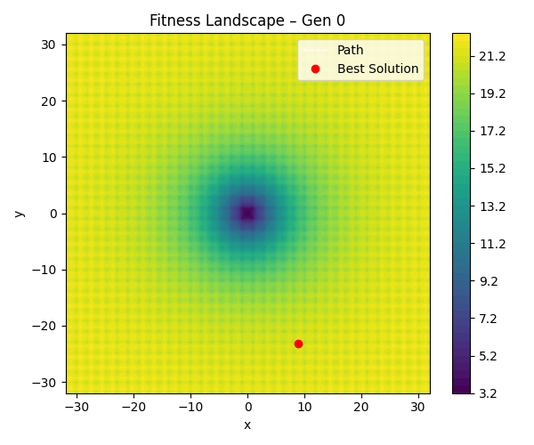
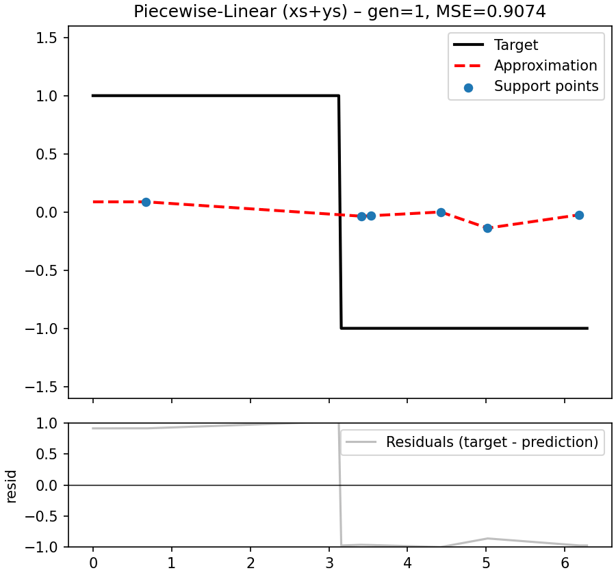

# 05_advanced_topics - Advanced Topics

This folder contains examples that go **beyond basic function approximation and strategies**, focusing on  
challenging landscapes, dynamic environments, and multi-module setups.
The goal is to illustrate how EvoLib can handle advanced optimization setups such as landscape visualization, benchmark functions, trajectory planning, and multi-module evolution.

## Learning Goals

* Explore **fitness landscapes** and visualize evolutionary search dynamics.
* Understand optimization on **non-trivial benchmark functions** (e.g., Rosenbrock).
* Learn how to evolve **control vectors** for navigation tasks.
* See how to integrate **obstacles and constraints** into evolutionary optimization.
* Experiment with **multi-module setups**, where one module carries parameters (e.g., mutation strength)  
  that co-evolve with the main solution.

## Prerequisites

* Knowledge from `01_basic_usage`, `02_strategies`, and `04_function_approximation`.
* Basic understanding of **benchmark functions** (Rosenbrock) and **control tasks** (path following).
* Familiarity with interpreting **fitness landscapes** and animated evolutionary runs.

## Files & Expected Output

Running these scripts will generate GIF animations in corresponding subfolders (`01_frames_landscape`,  
`02_frames_rosenbrock`, `03_frames_vector_control`, etc.).

---

### `01_fitness_landscape_exploration.py`

Visualizes how a population explores a **2D fitness landscape**.  
Demonstrates local minima, exploration vs. exploitation, and the effect of step size.

  

---

### `02_rosenbrock_surface_path.py`

Optimizes the **Rosenbrock function** (a classical benchmark with a curved valley).  
Illustrates difficulty of navigating narrow curved landscapes.

  

---

### `03_vector_control.py`

Evolves a **control vector** that determines waypoints in a plane.  
Shows how simple vector encodings can be used for trajectory planning.

  

---

### `04_vector_control_with_obstacles.py`

Extends vector control with **obstacles in the environment**.  
The evolved paths must avoid collisions while reaching the goal.

  

---

### `05_piecewise_linear_xsys.py`

Uses **piecewise-linear support points** for approximating signals.  
Each individual encodes X- and Y-coordinates, allowing flexible curve shapes.  
Useful for tasks where both **input positions and outputs** must be co-optimized.

  

---

## See Also

* [`../04_function_approximation/`](../04_function_approximation) — function approximation tasks.
* [`../06_netvector/`](../06_netvector) — neural-network-based encodings.
* [`../07_evonet/`](../07_evonet) — structural neuroevolution examples.

