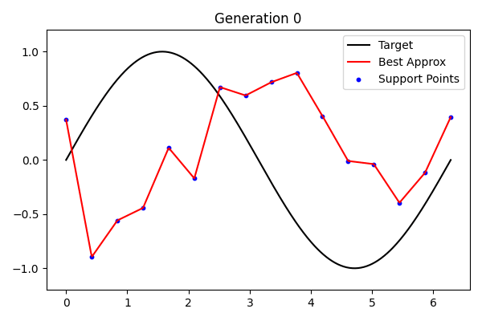
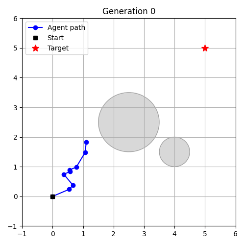

## 🧠 Advanced Topics in Evolutionary Optimization

This section explores advanced scenarios where evolutionary strategies are applied to more challenging or realistic problems. These include multi-objective trade-offs, fitness landscape visualization, and vector-based control tasks.

---

### 📘 01 - Multi-Objective Optimization: Fit vs. Smoothness

* **File:** `01_multiobjective_tradeoff.py`
* **Goal:** Approximate a sine function while balancing accuracy and smoothness
* **Representation:** Support points + linear interpolation
* **Fitness:** Weighted sum:
  $\text{MSE} + \lambda \cdot \text{Smoothness Penalty}$
* **Extras:** Logs both metrics (`extra_metrics`) for Pareto analysis
* **Output:** `01_frames_multiobjective/`

---

  

---

### 📘 02 - Fitness Landscape Exploration

* **File:** `02_fitness_landscape_exploration.py`
* **Goal:** Visualize and analyze the fitness surface of a benchmark function
* **Function:** Ackley (2D)
* **Plot:** Contour map with current best point
* **Use:** To understand optimization dynamics
* **Output:** `02_frames_landscape/`

---

  

---

### 📘 03 – Rosenbrock Surface with Optimization Path

* **File:** `03_rosenbrock_surface_path.py`
* **Goal:** Show how an evolutionary strategy navigates the narrow valley of the Rosenbrock function
* **Visualization:** 3D surface with real-time optimization path
* **Output:** `03_frames_rosenbrock/`

---

  

---

### 📘 03 – Vector-Based Control (No Neural Net)

* **File:** `03_vector_control.py`
* **Task:** Reach a target using a sequence of velocity vectors
* **Representation:** Flat vector with 2×N dimensions (x/y velocity at each time step)
* **Fitness:** Final distance to goal
* **Output:** `03_frames_vector_control/`

---

  

---

### 📘 04 – Vector-Based Control with Obstacles

* **File:** `04_vector_control_with_obstacles.py`
* **Goal:** Reach target while avoiding circular obstacles
* **Encoding:** Same as 03
* **Fitness:** Final distance + penalty for obstacle collisions
* **Penalty:** Soft quadratic penalty per contact
* **Output:** `04_frames_vector_obstacles/`

---

  

