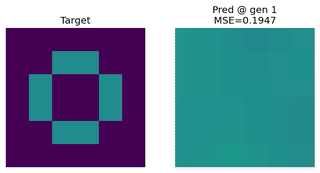

## 🧠 EvoNet Experiments

This section introduces EvoNet — an evolvable neural network representation with explicit topology. It supports evolving both parameters and structure, enabling more flexible and interpretable controllers compared to fixed architectures.

---

### 📘 01 – Sine Approximation with EvoNet

* **File:** `01_evonet_sine_approximation.py`
* **Goal:** Approximate the function `y = sin(x)` in the domain `[0, 2π]`
* **Input Normalization:** Input is scaled to `[-1.0, 1.0]` for better network performance
* **Architecture:** Fixed feedforward EvoNet (`dim: [1, 16, 16, 1]`)
* **Mutation:** Weight and bias mutation (Gaussian)
* **Fitness:** Mean Squared Error (MSE) between predicted and true sine values
* **Visualization:** 
  * Network structure using `net.print_graph(...)`
  * Combined into animated frames for export
* **Output:** `01_frames/gen_XXXX.png` (combined network and fit per generation)

---

  

---

### 📗 02 – Tiny Image Approximation with EvoNet

* **File:** `02_image_approximation.py`
* **Goal:** Learn a tiny grayscale image by mapping 2D coordinates `(x, y)` -> intensity `[0, 1]`. Fitness is the **MSE** between predicted and target image.
* **Input Normalization:** Coordinates are normalized to `[-1, 1]`.
* **Target:** Synthetic pattern (ring + horizontal bar) to keep the task interpretable.
* **Architecture:** EvoNet (`2 -> … -> 1`), defined in the YAML config `configs/02_evonet_image_approximation.yaml`.
* **Mutation:** Gaussian mutation on weights & biases; strategy and parameters come from the config.
* **Fitness:** Mean Squared Error (MSE) between predicted and target image.
* **Visualization:** Saves side-by-side target vs. prediction frames whenever the best fitness improves.
* **Output:** `02_frames/gen_XXXX.png` (progress frames).

---

  

