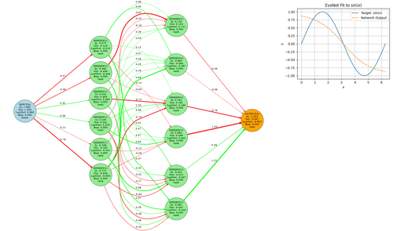
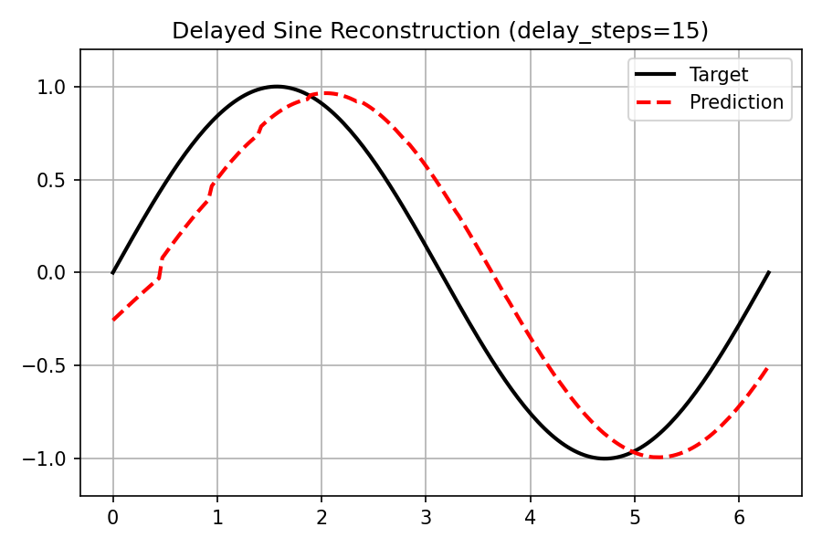

# 07_evonet – Evolvable Neural Networks

This folder contains examples using **EvoNet**, an evolvable neural network representation with explicit topology.  
Unlike fixed NetVectors, EvoNet supports **both parameter and structural evolution**, enabling more flexible and interpretable controllers.

---

## Learning Goals

* Understand how EvoNet represents networks as explicit graphs.  
* Compare fixed and evolving network architectures.  
* Observe structural mutations (add/remove neurons, connections).  

---

## Prerequisites

* Basic neural-network concepts.  
* EvoNet basics from the preceding examples.

---

## Files & Expected Output

Each script prints generation progress and produces output frames that visualize either the network structure, the task behavior, or both.

---

### `01_sine_approximation.py`

Approximates **y = sin(x)** on `[0, 2π]` with a fixed EvoNet (`[1, 16, 16, 1]`).  
Gaussian weight mutation, fitness is MSE vs. sine.  
Output frames combine network graph and function fit.

  

---

### `02_sine_delay.py`

Demonstrates **explicit recurrent delay semantics** using a minimal delay-line task.

The network receives a one-dimensional input signal `u[t] = sin(t)` and must
output the same signal delayed by *k* time steps (`u[t−k]`).
The task is intentionally simple and does **not** focus on learning capacity.
Instead, it isolates and validates the behavior of explicit recurrent delays
(delay buffers, warm-up, and reset semantics).

Key aspects:
* Input is the signal value, not time or phase.
* A fixed recurrent self-loop with static delay is used.
* The first `k` steps are excluded from fitness due to delay buffer warm-up.
* The example serves as a **reference and correctness test** for EvoNet delays.

  

---

### `03_image_approximation.py`

Learns a tiny grayscale image by mapping `(x, y)` → intensity `[0, 1]`.  
EvoNet evolves weights (Gaussian mutation) to minimize MSE vs. the target image.  
Frames show target and prediction side by side.

  

---

### `04_structural_xor.py`

Solves the XOR problem using **structural mutations** (`add_neuron`, `add_connection`).  
Starts from a minimal `[2, 1]` net and grows topology as needed.  
Frames show both network graph and XOR predictions.

  

---

### `05_recurrent_bit_prediction.py`

Demonstrates how EvoNet with recurrent connections can learn to predict 
the next bit in a deterministic sequence generated by a 5-bit LFSR.
Frames show input, target, and predicted bits (raster + line plot)

  

---

### `06_recurrent_timeseries.py`

Predicts **x[t+PRED_LEN] from x[t]** on synthetic sequences with trend switches.
Unlike previous function-approximation tasks, the network does **not** see the full input at once.
Instead, the time series is fed **step by step through a single input channel**.
Recurrent connections allow the EvoNet to maintain internal state and look ahead.

Key aspects:
* Fitness is the mean squared error (MSE) between prediction and future values.
* Multiple evaluation runs with different seeds improve robustness.
* Each generation’s best individual is plotted against the input sequence.
* A naive baseline predictor (`y_pred = x[t]`) is included for comparison.
* At the end, an optional **generalization test** shows performance on a completely new sequence.

  

---

### `07_recurrent_trading.py`

Evolves a recurrent EvoNet to act as a **trading strategy**.  
At each time step, the network sees only the **current input** (price at time *t*),
not the entire series at once. Its recurrent connections provide the necessary memory
to classify short-term trends.  

The network performs a **classification** into 5 discrete categories
(from *strongly down* to *strongly up*) and converts these predictions
into trading actions (open, close, switch).  

The purpose of this example is **not to design a real trading system**,
but to illustrate how sequential classification can be coupled with decision-making.
Fitness is based on trading profit (averaged across episodes).
Frames show both the price series with trade markers and the resulting equity curve.

  

## See Also

* [`../06_netvector/`](../06_netvector) — fixed-topology networks as vectors.  
* [`../05_advanced_topics/`](../05_advanced_topics) — advanced control and function-approximation setups.

