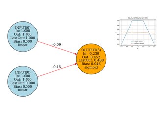

# 07_evonet – Evolvable Neural Networks

This folder contains examples using **EvoNet**, an evolvable neural network representation with explicit topology.  
Unlike fixed NetVectors, EvoNet supports **both parameter and structural evolution**, enabling more flexible and interpretable controllers.

---

## Learning Goals

* Understand how EvoNet represents networks as explicit graphs.  
* Compare fixed vs. evolving architectures.  
* Observe structural mutations (add/remove neurons, connections).  

---

## Prerequisites

* Basic neural-network concepts.  
* EvoNet basics from the preceding examples.

---

## Files & Expected Output

Each script prints generation progress and produces frames (`01_frames`, `02_frames`, `03_frames`) that visualize both the **network structure** and the **approximation task**.

---

### `01_sine_approximation.py`

Approximates **y = sin(x)** on `[0, 2π]` with a fixed EvoNet (`[1, 16, 16, 1]`).  
Gaussian weight mutation, fitness is MSE vs. sine.  
Output frames combine network graph and function fit.

  

---

### `02_image_approximation.py`

Learns a tiny grayscale image by mapping `(x, y)` → intensity `[0, 1]`.  
EvoNet evolves weights (Gaussian mutation) to minimize MSE vs. the target image.  
Frames show target and prediction side by side.

  

---

### `03_structural_xor.py`

Solves the XOR problem using **structural mutations** (`add_neuron`, `add_connection`, `split_connection`).  
Starts from a minimal `[2, 1]` net and grows topology as needed.  
Frames show both network graph and XOR predictions.

  

---

### `04_recurrent_bit_prediction.py`

Demonstrates how EvoNet with recurrent connections can learn to predict 
the next bit in a deterministic sequence generated by a 5-bit LFSR.
Frames shows input, target, and predicted bits (raster + line plot)

  

---

## See Also

* [`../06_netvector/`](../06_netvector) — fixed-topology networks as vectors.  
* [`../05_advanced_topics/`](../05_advanced_topics) — advanced control and function-approximation setups.

