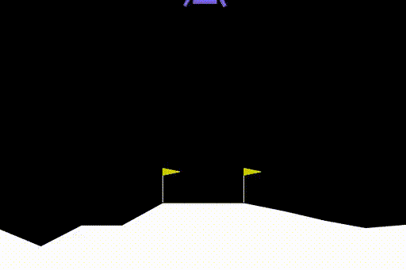

# 08_gym – Reinforcement Learning Environments

This folder contains examples where EvoLib individuals interact with **Gymnasium environments**.  
The focus is on **control tasks** (discrete or continuous) where the evolved networks act as policies.  

Unlike the function approximation or EvoNet-only demos, these tasks involve 
**step-by-step interaction with an external environment** that provides 
observations, rewards, and termination signals.

---

## Prerequisites

* Basic Gymnasium concepts (`env.reset()`, `env.step(action)`).  
* EvoLib basics: populations, individuals, fitness assignment.  
* Installed extras:  
  ```bash
  pip install gymnasium[box2d] imageio
  ```

---

## Files & Expected Output

Each script prints generation progress and produces GIFs (in `01_frames`, `02_frames`, …) 
that visualize how the best individual acts inside the environment.  

---

### `frozen_lake.py`

Solves the [FrozenLake-v1](https://gymnasium.farama.org/environments/toy_text/frozen_lake) task from Gymnasium’s *Toy Text* suite.  

The agent must reach the goal (`G`) from the start (`S`) while avoiding holes (`H`).  
States are discrete grid positions, actions are {left, down, right, up}.  

* With `is_slippery=True` (default), transitions are stochastic --> policies must be **robust**, not deterministic.  
* Fitness is the total reward (0 or 1) averaged across episodes.  
* EvoLib’s evolution gradually increases the success probability by preferring safer paths.  

Output: GIFs in `01_frames/` show the current best policy navigating the grid.

<p align="center">
  
</p>

---

### `02_cliff_walking.py`

Trains on the **CliffWalking-v1** environment.
Although part of Gymnasium’s *ToyText* suite and described as “extremely simple,” it is in fact a **very challenging setup** for both Reinforcement Learning and Evolutionary Algorithms.

The difficulty stems from the **reward structure**:

- Every step costs `-1`, regardless of movement or standing still.
- Falling into the cliff adds `-100` and ends the episode.
- Reaching the goal yields `0`.

This creates a **paradoxical fitness landscape** where apparent progress is rare, and strategies that are actually suboptimal may be preferred by evolution.

---

#### Example rewards (1 episode, `max_steps=20`)

| Behavior                  | Reward | Interpretation |
|----------------------------|--------|----------------|
| Stand still (20 steps)     | -20    | “safe but useless” |
| Fall into cliff at step 5  | -105   | much worse |
| Fall into cliff at step 15 | -115   | even worse |
| Reach goal in 12 steps     | -12    | best |

---

**Takeaway:**
CliffWalking effectively acts as an **anti-evolution environment**:
progress appears only rarely, and evolution tends to preserve “standing” strategies while truly successful behaviors (reaching the goal) emerge only by chance.

The value lies in understanding how the fitness definition and the reward structure interact, sometimes leading to counterintuitive or stagnant evolutionary dynamics.

---

### `03_cartpole.py`

Evolves a neural controller to solve [CartPole-v1](https://gymnasium.farama.org/environments/classic_control/cart_pole).  
The agent receives the 4-dimensional observation (cart position, velocity, pole angle, angular velocity) and outputs a discrete action (left or right).  
* Fitness: cumulative reward (number of balanced steps).  
* Visualization: best individual of each generation rendered as GIFs.  

<p align="center">
  
</p>

---

### `04_lunarlander.py`

Evolves a neural-network controller for the [LunarLander](https://gymnasium.farama.org/environments/box2d/lunar_lander) environment.  
The agent learns to control a lander with discrete thruster commands in order to 
land safely between the flags.  

* Fitness: negative cumulative reward from one episode (minimization).  
* Observation space: continuous (position, velocity, angle, contact flags).  
* Action space: discrete thruster commands.  
* Visualization: every 20 generations (and at the end), the best individual is rendered and saved as an animated GIF.

<p align="center">
  
</p>

---

## See Also

* [`../07_evonet/`](../07_evonet) — evolvable neural networks for function approximation.  
* [Gymnasium Environments](https://gymnasium.farama.org/environments/) — full list of available tasks.
