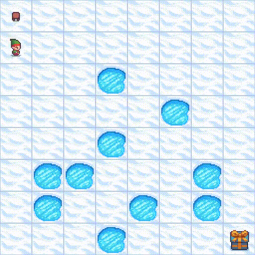

# 08_gym – Reinforcement Learning Environments

This folder contains examples where EvoLib individuals interact with **Gymnasium environments**.  
The focus is on **control tasks** (discrete or continuous) where the evolved networks act as policies.  

Unlike the function approximation or EvoNet-only demos, these tasks involve 
**step-by-step interaction with an external environment** that provides 
observations, rewards, and termination signals.

---

## Prerequisites

* Basic Gymnasium concepts (`env.reset()`, `env.step(action)`).  
* EvoLib basics: populations, individuals, fitness assignment.  
* Installed extras: `gymnasium`, `imageio` (for GIF rendering).  

---

## Files & Expected Output

Each script prints generation progress and produces GIFs (in `01_frames`, `02_frames`, …) 
that visualize how the best individual acts inside the environment.  

---

### `frozen_lake.py`

Solves the [FrozenLake-v1](https://gymnasium.farama.org/environments/toy_text/frozen_lake) task from Gymnasium’s *Toy Text* suite.  

The agent must reach the goal (`G`) from the start (`S`) while avoiding holes (`H`).  
States are discrete grid positions, actions are {left, down, right, up}.  

* With `is_slippery=True` (default), transitions are stochastic --> policies must be **robust**, not deterministic.  
* Fitness is the total reward (0 or 1) averaged across episodes.  
* EvoLib’s evolution gradually increases the success probability by preferring safer paths.  

Output: GIFs in `01_frames/` show the current best policy navigating the grid.

  

---

## See Also

* [`../07_evonet/`](../07_evonet) — evolvable neural networks for function approximation.  
* [Gymnasium Environments](https://gymnasium.farama.org/environments/) — full list of available tasks.
