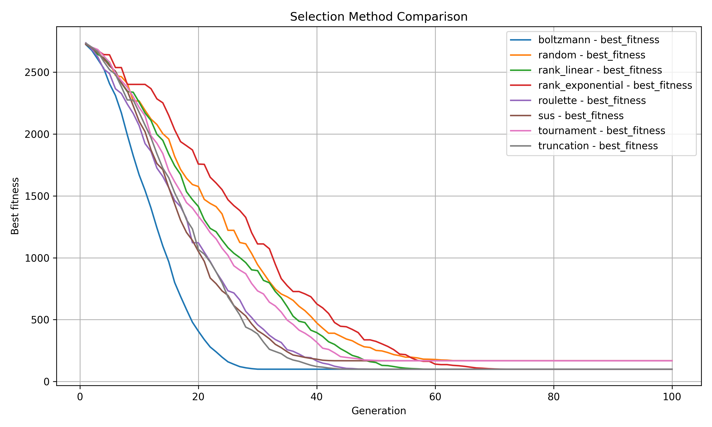
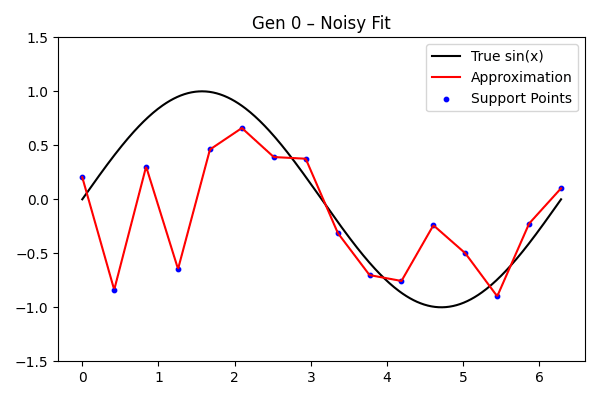
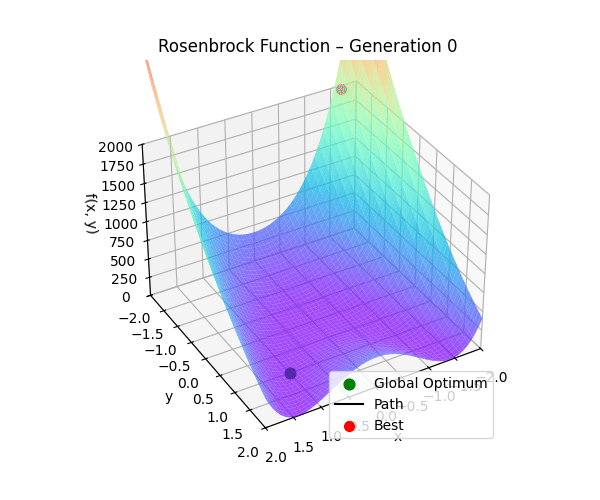
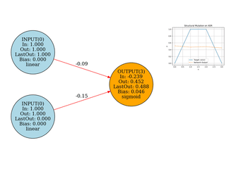
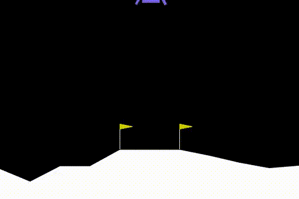
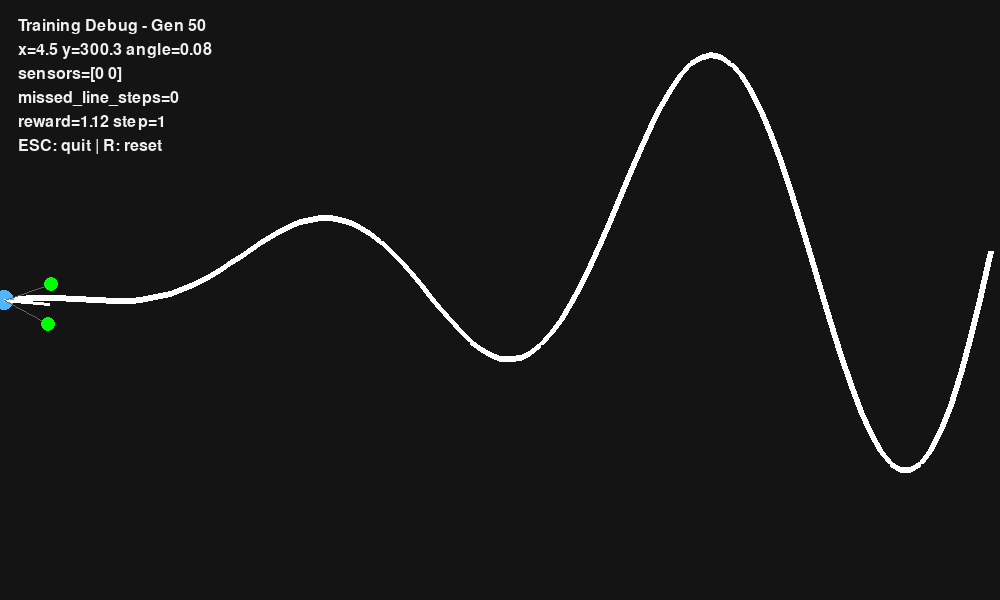

# EvoLib Examples

This directory contains examples and tutorials for EvoLib.

The examples are ordered from basic evolutionary mechanisms to neural networks,
Gymnasium integration, EvoEnv environments.

---

## Overview

| Directory | Focus |
|---|---|
| `01_basic_usage/` | Basic individuals, populations, mutation, and fitness evaluation |
| `02_strategies/` | Evolution strategies, selection, offspring generation, and adaptive mutation |
| `03_comparisons/` | Logging, plotting, and comparing evolutionary runs |
| `04_function_approximation/` | Evolutionary approximation of mathematical target functions |
| `05_advanced_topics/` | Constraints, multi-objective fitness, landscapes, and vector-based control |
| `06_netvector/` | NetVector as a simplified neural computation representation |
| `07_evonet/` | EvoNet, structural mutation, and evolvable neural networks |
| `08_gym/` | Integration with Gymnasium environments |
| `09_evoenv/` | EvoEnv visual environments with play, rule, train, and watch workflow |

The examples are intentionally ordered by complexity and build upon
previous concepts where possible.

---

## 01_basic_usage/

Introductory examples covering:

- creating individuals and populations
- applying mutation
- evaluating fitness
- inspecting parameter and fitness changes

### Example output
```
$ python 04_fitness.py
Before mutation:
  Indiv 0: Parameter = -0.4380, Fitness = 0.036788
  Indiv 1: Parameter = -0.4446, Fitness = 0.039056
  Indiv 2: Parameter = -0.1907, Fitness = 0.001322
  Indiv 3: Parameter = 0.4820, Fitness = 0.053994
  Indiv 4: Parameter = 0.1479, Fitness = 0.000479
  Indiv 5: Parameter = -0.4775, Fitness = 0.051983
  Indiv 6: Parameter = -0.2960, Fitness = 0.007681
  Indiv 7: Parameter = 0.2359, Fitness = 0.003097
  Indiv 8: Parameter = 0.0552, Fitness = 0.000009
  Indiv 9: Parameter = -0.3034, Fitness = 0.008479

After mutation:
  Indiv 0: Parameter = -0.4375, Fitness = 0.036635
  Indiv 1: Parameter = -0.4392, Fitness = 0.037199
  Indiv 2: Parameter = -0.2031, Fitness = 0.001702
  Indiv 3: Parameter = 0.4796, Fitness = 0.052911
  Indiv 4: Parameter = 0.1452, Fitness = 0.000445
  Indiv 5: Parameter = -0.4791, Fitness = 0.052694
  Indiv 6: Parameter = -0.2892, Fitness = 0.006993
  Indiv 7: Parameter = 0.2352, Fitness = 0.003062
  Indiv 8: Parameter = 0.0535, Fitness = 0.000008
  Indiv 9: Parameter = -0.2976, Fitness = 0.007847
```

See: [`01_basic_usage/README.md`](01_basic_usage/README.md)

---

## 02_strategies/

Demonstrates core evolutionary strategies:

- `(μ, λ)` and `(μ + λ)` strategies
- step-by-step evolution
- parent and offspring handling
- adaptive global mutation


### Example output
```
python 01_step_by_step_evolution.py
Parents:
  Indiv 0: Parameter = -0.3691, Fitness = 0.018565
  Indiv 1: Parameter = 0.2371, Fitness = 0.003158

Offspring before mutation:
  Indiv 0: Parameter = 0.2371, Fitness = 0.003158
  Indiv 1: Parameter = -0.3691, Fitness = 0.018565
  Indiv 2: Parameter = -0.3691, Fitness = 0.018565
  Indiv 3: Parameter = 0.2371, Fitness = 0.003158

Offspring after mutation:
  Indiv 0: Parameter = 0.2171, Fitness = 0.002220
  Indiv 1: Parameter = -0.3897, Fitness = 0.023055
  Indiv 2: Parameter = -0.3793, Fitness = 0.020699
  Indiv 3: Parameter = 0.2520, Fitness = 0.004036

Population before Selection
  Indiv 0: Parameter = -0.3691, Fitness = 0.018565
  Indiv 1: Parameter = 0.2371, Fitness = 0.003158
  Indiv 2: Parameter = 0.2171, Fitness = 0.002220
  Indiv 3: Parameter = -0.3897, Fitness = 0.023055
  Indiv 4: Parameter = -0.3793, Fitness = 0.020699
  Indiv 5: Parameter = 0.2520, Fitness = 0.004036

Population after Selection
  Indiv 0: Parameter = 0.2171, Fitness = 0.002220
  Indiv 1: Parameter = 0.2371, Fitness = 0.003158
```

See: [`02_strategies/README.md`](02_strategies/README.md)

---

## 03_comparisons/

Tools for logging, plotting, and comparing evolutionary runs:

- fitness history tracking
- plotting fitness over generations
- comparing selection and strategy variants
- inspecting run stability

### Example output
<p align="center">
  
</p>


See: [`03_comparisons/README.md`](03_comparisons/README.md)

---

## 04_function_approximation/

Demonstrates evolutionary optimization for function approximation.

Covered approaches include:

- polynomial approximation
- support point approximation
- approximation with noise

### Example output:
<p align="center">
  
</p>


See: [`04_function_approximation/README.md`](04_function_approximation/README.md)

---

## 05_advanced_topics/

This chapter explores more realistic and complex scenarios in evolutionary optimization:

- constrained optimization with penalty and repair strategies
- multi-objective optimization (e.g., fit vs. smoothness)
- fitness landscape visualization (2D and 3D surface plots)
- vector-based control tasks without neural networks

These examples demonstrate how evolutionary strategies can handle structured environments, trade-offs, and sequential decisions.

### Example output
<p align="center">
  
</p>

See: [`05_advanced_topics/README.md`](05_advanced_topics/README.md)

---

## 06_netvector/

Demonstrates NetVector, a simplified vector-based representation of neural computation.

NetVector is intended as an intermediate step between plain parameter vectors
and fully structured EvoNet architectures. It allows simple neuron-like
computation and signal flow without the complexity of dynamic topology growth.

This makes NetVector useful for core concepts such as weighted signal
processing, controller behavior, and evolutionary optimization before
introducing structurally evolving neural networks.

See: [`06_netvector/README.md`](06_netvector/README.md)

---

## 07_evonet/

Examples for EvoNet, a modular, evolvable neural network architecture capable of topological growth and structural mutation.

Topics include:

- neural network controllers
- structural mutation
- topology growth
- recurrent or delayed behavior where supported
- visual inspection of evolved networks

### Example output
<p align="center">
  
</p>

See: [`07_evonet/README.md`](07_evonet/README.md)

---

## 08_gym/

Examples where EvoLib individuals interact with **Gymnasium environments**.


These examples show how EvoLib can optimize controllers for existing benchmark
environments while keeping the EvoLib population, mutation, and evaluation
pipeline.

### Example output

<p align="center">
  
</p>

📄 See: [`08_gym/README.md`](08_gym/README.md)

---

## 09_evoenv/ – EvoEnv

EvoEnv contains small visual environments for understanding controller
behavior and evolutionary learning.

The environments are designed for visualization, experimentation,
and understanding evolutionary controller behavior.

- observations
- actions
- rewards
- controller behavior
- evolved neural network behavior
- adaptive behavior

The environments are designed around a consistent workflow:

```text
play -> rule -> train -> watch
```

| Step | Script type | Purpose |
|---|---|---|
| `play.py` | Manual control | Understand the task and controls |
| `rule.py` | Rule-based baseline | Show a simple hand-written policy |
| `train.py` | Evolutionary training | Evolve an EvoNet controller with EvoLib |
| `watch.py` | Visualization | Load and inspect the best saved individual |

Current environments:

| Environment | Focus |
|---|---|
| `01_line_follower/` | Sensor-based steering and continuous correction |
| `02_jumper/` | Timing, discrete decisions, and delayed action effects |

### Example output
<p align="center">
  
</p>

See: [`09_evoenv/README.md`](09_evoenv/README.md)

---

## Requirements

### Core

- Python 3.12+
- EvoLib

### Optional

| Feature | Dependency |
|---|---|
| Gym examples | gymnasium |
| EvoEnv visualizations | pygame |


Install optional interactive environment dependency:

```bash
pip install pygame
```

---

## Running Examples

Most examples can be run directly from their directory:

```bash
python script_name.py
```

For examples using YAML configuration files, run the script from the directory
where the expected config path is valid.


## Notes

- All scripts rely on configuration files in YAML format
- Some examples output visualizations into the `figures/` folders
- Examples require being run from their local example directory
