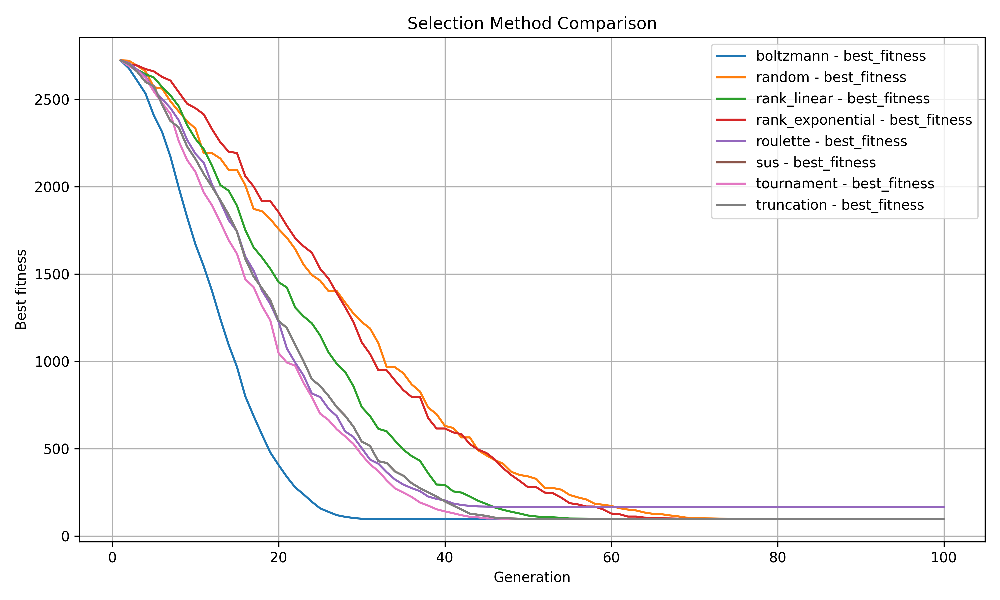

# EvoLib Examples

This directory contains usage examples and tutorials for working with EvoLib.

---

## 📁 01_basic_usage/

Introductory examples covering:

- Creating individuals and populations
- Applying mutation
- Fitness evaluation

## Sample output
```
$ python 04_fitness.py
Before mutation:
  Indiv 0: Parameter = -0.4380, Fitness = 0.036788
  Indiv 1: Parameter = -0.4446, Fitness = 0.039056
  Indiv 2: Parameter = -0.1907, Fitness = 0.001322
  Indiv 3: Parameter = 0.4820, Fitness = 0.053994
  Indiv 4: Parameter = 0.1479, Fitness = 0.000479
  Indiv 5: Parameter = -0.4775, Fitness = 0.051983
  Indiv 6: Parameter = -0.2960, Fitness = 0.007681
  Indiv 7: Parameter = 0.2359, Fitness = 0.003097
  Indiv 8: Parameter = 0.0552, Fitness = 0.000009
  Indiv 9: Parameter = -0.3034, Fitness = 0.008479

After mutation:
  Indiv 0: Parameter = -0.4375, Fitness = 0.036635
  Indiv 1: Parameter = -0.4392, Fitness = 0.037199
  Indiv 2: Parameter = -0.2031, Fitness = 0.001702
  Indiv 3: Parameter = 0.4796, Fitness = 0.052911
  Indiv 4: Parameter = 0.1452, Fitness = 0.000445
  Indiv 5: Parameter = -0.4791, Fitness = 0.052694
  Indiv 6: Parameter = -0.2892, Fitness = 0.006993
  Indiv 7: Parameter = 0.2352, Fitness = 0.003062
  Indiv 8: Parameter = 0.0535, Fitness = 0.000008
  Indiv 9: Parameter = -0.2976, Fitness = 0.007847
```

📄 See: [`01_basic_usage/README.md`](01_basic_usage/README.md)

---

## 📁 02_strategies/

Demonstrates various evolutionary strategies:

- (μ, λ) and (μ + λ) strategies
- Step-by-step evolution
- Adaptive global mutation


## Sample output
```
python 01_step_by_step_evolution.py
Parents:
  Indiv 0: Parameter = -0.3691, Fitness = 0.018565
  Indiv 1: Parameter = 0.2371, Fitness = 0.003158

Offspring before mutation:
  Indiv 0: Parameter = 0.2371, Fitness = 0.003158
  Indiv 1: Parameter = -0.3691, Fitness = 0.018565
  Indiv 2: Parameter = -0.3691, Fitness = 0.018565
  Indiv 3: Parameter = 0.2371, Fitness = 0.003158

Offspring after mutation:
  Indiv 0: Parameter = 0.2171, Fitness = 0.002220
  Indiv 1: Parameter = -0.3897, Fitness = 0.023055
  Indiv 2: Parameter = -0.3793, Fitness = 0.020699
  Indiv 3: Parameter = 0.2520, Fitness = 0.004036

Population befor Selection
  Indiv 0: Parameter = -0.3691, Fitness = 0.018565
  Indiv 1: Parameter = 0.2371, Fitness = 0.003158
  Indiv 2: Parameter = 0.2171, Fitness = 0.002220
  Indiv 3: Parameter = -0.3897, Fitness = 0.023055
  Indiv 4: Parameter = -0.3793, Fitness = 0.020699
  Indiv 5: Parameter = 0.2520, Fitness = 0.004036

Population after Selection
  Indiv 0: Parameter = 0.2171, Fitness = 0.002220
  Indiv 1: Parameter = 0.2371, Fitness = 0.003158
```

📄 See: [`02_strategies/README.md`](02_strategies/README.md)

---

## 📁 03_comparison/

Tools for logging, plotting, and comparing multiple evolutionary runs:

- Fitness history tracking
- Plotting over generations
- Cross-run comparison

## Sample output
<p align="center">
  
</p>


📄 See: [`03_comparisons/README.md`](03_comparisons/README.md)

---
## 📁 04_function_aproximation/

Demonstrates how evolutionary optimization can be used to approximate a mathematical target function—specifically, the sine function—using two fundamentally different approaches

- Polynomial Approximation
- Support Point Approximation
- Approximation with Noise

## Sample output
<p align="center">
  
</p>


📄 See: [`04_function_approximation/README.md`](04_function_approximation/README.md)

---

## 📁 05_advanced_topics/

This chapter explores more realistic and complex scenarios in evolutionary optimization:

- Constrained optimization with penalty and repair strategies
- Multi-objective optimization (e.g., fit vs. smoothness)
- Fitness landscape visualization (2D and 3D surface plots)
- Vector-based control tasks without neural networks, including obstacle avoidance

These examples demonstrate how evolutionary strategies can handle structured environments, trade-offs, and sequential decisions.

## Sample output
<p align="center">
  
</p>

📄 See: [`05_advanced_topics/README.md`](05_advanced_topics/README.md)

---

## 📁 06_netvector/

Demonstrates NetVector modules — a simplified vector-based representation of neural computation

📄 See: [`06_netvector/README.md`](06_netvector/README.md)

---

## 📁 07_evonet/

Examples for EvoNet, a modular, evolvable neural network architecture capable of topological growth and structural mutation.

## Sample output

<p align="center">
  
</p>

📄 See: [`07_evonet/README.md`](07_evonet/README.md)

---

## 📁 08_gym/

Examples where EvoLib individuals interact with **Gymnasium environments**

## Sample output

<p align="center">
  
</p>

📄 See: [`08_gym/README.md`](08_gym/README.md)

---


## 📌 Notes

- All scripts rely on configuration files in YAML format
- Some examples output visualizations into the `figures/` folders
- Examples are self-contained and runnable with `python script.py`

